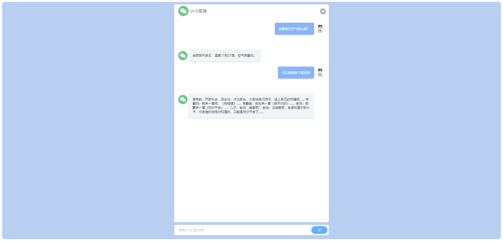

# 公众号如何接入微信机器人

[微信对话开放平台文档](https://developers.weixin.qq.com/doc/aispeech/platform/INTRODUCTION.html)

# 官方文档

## 平台简介

微信对话开放平台开放了微信在对话领域积累多年的的智能对话技术，开发者及非开发者可简单、快速地搭建智能对话机器人（智能客服）,
并接入公众号、小程序等，为业务赋能，降本增效。
也欢迎你加入开发者社区 一起讨论相关问题。

按照文档相关指引将机器人接入到自己的公众号中。

## 微信对话开放平台

地址：https://chatbot.weixin.qq.com/

## 发布上线

## 加入自己公众号

## Chat

同时已开放API接口，供我们自己调用。

# 开放API接口对接

## 效果图如下所示

## 步骤

